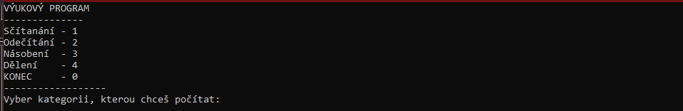
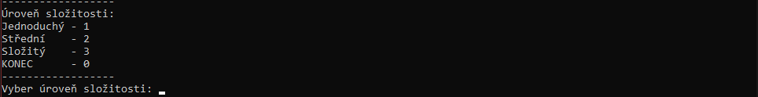
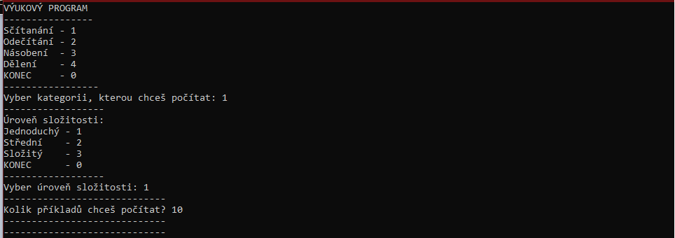
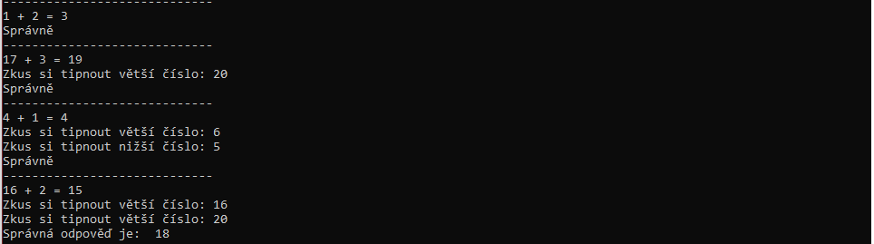
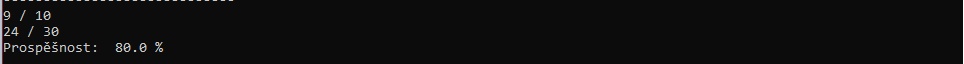
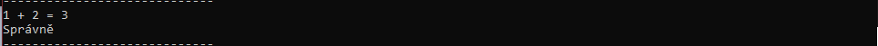
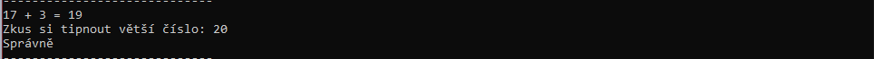
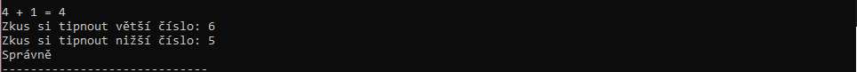
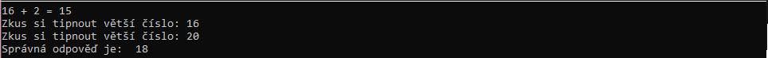

# vyukovy_program

Program bude na procvičování jednoduché matiky (+ - * /) a má různé složitosti (dohromady bude 3 úrovní složitosti).
Program bude generovat příklady a uživatel bude psát odpovědí. Uživatel bude mít 3 možnosti na zadání správné odpovědí, a pak po zadání 3 nesprávně program vypíše správnou odpověď.
Ze strány uživatele:
1) zadá úroveň složitosti
2) počet příkladů, které chce počítat
3) a pak jen řešit příklady

Program vygeneruje příklady, zkontroluje řešení a pak vypíše na konci počet bodů celkově za správně řešené úlohy a počet správně a špatně řešených úloh.

## Cíl

Cílem tohoto programu je procvičení sčítání/odečítání/násobení/dělení různě velkých čísel.

## Použití

Program se spouští spuštěním [vyukovy_program.py](vyukovy_program.py). Po spouštění tohoto programu se objeví okno s menu.

Uživatel vybere nějakou kategorii y menu. Pak se objeví další menu s úrovní složitostí.

Uživatel vybere úroveň složitostí, pak napíše počet příkladů, které chce počítat.

Takto vypadá celé menu s předvyplněnými položkami.

Pak začíná náhodné generování příkladú podle kategorii a úrovní složitostí.

Po ukončení počítání program vyíiše prospěšnost: počet správně řešených příkladů y celkového počtů, počet získaných bodů a procentní úspěšnost.

### Bodování

Každý příklad je za 3 body. Uživatel na 3 pokusy na řešení příkladu, každý další pokus -1 bod. Např. 
Za 3 body

Za 2 body

Za 1 bod

Za 0 bodů

